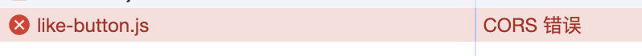
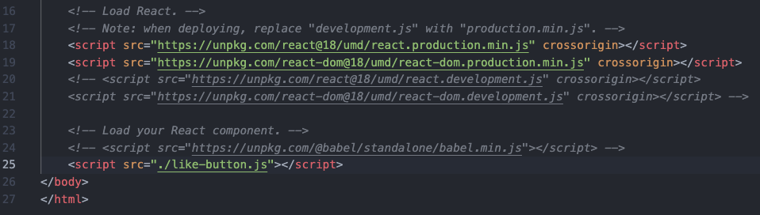

无需使用 React 重构你的站点。只需花一分钟，将 React 添加到 HTML 中，且无需安装，即可立即开始编写交互式组件。
## 将React添加到HTML中
### 第一步，添加根标签
根标签可以是一个，也可以是多个。
```javascript
 <p>
    This is the first comment.
    <!-- We will put our React component inside this div. -->
    <div class="like-button-root" data-commentid="1"></div>
</p>
<p>
    This is the second comment.
    <!-- We will put our React component inside this div. -->
    <div class="like-button-root" data-commentid="2"></div>
</p>
<p>
    This is the third comment.
    <!-- We will put our React component inside this div. -->
    <div class="like-button-root" data-commentid="3"></div>
</p>
```
#### 第二步，添加依赖库
在 HTML 页面的 `</body>` 结束标签之前，添加三个 `<script>` 标签用于加载以下文件：
```javascript
<!-- end of the page -->
    <script src="https://unpkg.com/react@18/umd/react.development.js" crossorigin></script>
    <script src="https://unpkg.com/react-dom@18/umd/react-dom.development.js" crossorigin></script>
    <script src="like-button.js"></script>
  </body>
</html>
```
### 第三步，创建React组件
在 HTML 页面文件的同级目录下创建一个名为 like_button.js 的文件，并将如下代码片段添加到该文件中。这段代码定义了一个名为 LikeButton 的 React 组件。
```javascript
'use strict'
function LikeButton() {
    const [liked, setLiked] = React.useState(false);
    const text = liked ? 'You liked this.' : 'Like';
    return React.createElement('button',{
        onClick: () => setLiked(!liked),
      }, text);
}
```
`React.createElement(component, props, ...children)`，它接受三个参数。

以下是它的工作原理：

一个组件，它既可以是一个表示 HTML 标签名的字符串，也可以是一个函数组件。
一个对象，包含 你想传递给组件的 props。
其余的参数代表该组件可能拥有多个子元素，比如文本字符串或其他元素.

### 最后一步，将React组件添加到页面中
最后，在 like_button.js 底部添加以下三行代码。
```javascript
const domContainer = document.querySelector('#like-button-root');
// const domContainer = document.getElementById('like-button-root');
const root = ReactDOM.createRoot(domContainer);
root.render(React.createElement(LikeButton));
```
### 尝试使用JSX编写React
将like_button.js的语句改用JSX实现，让后使用[Babel](https://babeljs.io/setup/#installation)进行在线转义。
试用 JSX 的最快方法是将 Babel 编译器作为` <script> `标签引入页面中。把它放置在 like-button.js 之前，然后在 like-button.js 的 script 标签上添加 type="text/babel" 属性：

#### 第一处更新，将语法替换成JSX
```javascript
'use strict'
function LikeButton() {
    const [liked, setLiked] = React.useState(false);
    const text = liked ? 'You liked this.' : 'Like';
    return React.createElement('button',{
        onClick: () => setLiked(!liked),
      }, text);
}
```
更新成
```javascript
'use strict'
function LikeButton() {
    const [liked, setLiked] = React.useState(false);
    const text = liked ? 'You liked this.' : 'Like';
    return (
        <button type="button" onClick={() => setLiked(!liked)}>
            {text}
        </button>
    )
}
```
#### 第二处更新，加入Babel在线编译，用于将JSX语法在线转换成浏览器原生支持的语法
```javascript
<!-- end of the page -->
    <script src="https://unpkg.com/react@18/umd/react.development.js" crossorigin></script>
    <script src="https://unpkg.com/react-dom@18/umd/react-dom.development.js" crossorigin></script>
    <script src="like-button.js"></script>
  </body>
</html>
```
更新成
```javascript
<!-- end of the page -->
    <script src="https://unpkg.com/react@18/umd/react.development.js" crossorigin></script>
    <script src="https://unpkg.com/react-dom@18/umd/react-dom.development.js" crossorigin></script>
    <script src="https://unpkg.com/@babel/standalone/babel.min.js"></script>
    <script src="like-button.js" type="text/babel"></script>
  </body>
</html>
```
> 注意，添加babel编译后，link-button.js会提示跨域请求错误，为了方便测试我还是把组件放在了和依赖放在了同一个文件中

```javascript
<!-- end of the page -->
    <script src="https://unpkg.com/react@18/umd/react.development.js" crossorigin></script>
    <script src="https://unpkg.com/react-dom@18/umd/react-dom.development.js" crossorigin></script>
    <script src="https://unpkg.com/@babel/standalone/babel.min.js"></script>
    <script type="text/babel">
        function LikeButton() {
            const [liked, setLiked] = React.useState(false);
            const text = liked ? 'You liked this.' : 'Like';
            return (
                <button type="button" onClick={() => setLiked(!liked)}>
                    {text}
                </button>
            )
            // return React.createElement('button',{
            //     onClick: () => setLiked(!liked),
            //   }, text);
        }

        const domContainer = document.querySelector('#like-button-root');
        // const rootNode = document.getElementById('like-button-root');
        const root = ReactDOM.createRoot(domContainer);
        root.render(React.createElement(LikeButton));
    </script>
  </body>
</html>
```

###  设置可以用于生产环境的JSX预处理器
引入 Babel 的 `<script>` 编译器对于学习和创建简单的示例是很便捷的。但是，它会使网站变慢，并不适用于生产环境。
所以需要设置一个JSX的预处理器，将所有的JSX专为JS.

1. 创建一个名为 src 的文件夹,将已经 JSX 化的 like-button.js (它看起来应该像这样)！文件移动到新的 src 目录下
2. 在终端执行这个命令：npx babel --watch src --out-dir . --presets babel-preset-react-app/prod （无需等待运行结果 —— 这个命令会自动启动一个观察器，观察对 src 内 JSX 的编辑。）


